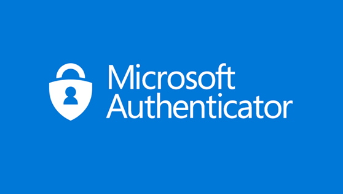

# How to use two-step verification with your Microsoft account

## What two-step verification is

Two-step verification helps protect you by making it more difficult for someone else to sign in to your Microsoft account. It uses two different forms of identity: your password, and a contact method (also known as security info). Even if someone else finds your password, they'll be stopped if they don't have access to your security info. This is also why it's important to use different passwords for all your accounts.

## What happens when you turn on two-step verification

If you turn on two-step verification, you’ll get a security code to your email, phone, or authenticator app every time you sign in on a device that isn't trusted. When two-step verification is turned off, you will only have to verify your identity with security codes periodically, when there might be a risk to your account security.

## What you'll need for set up

Two-step verification begins with an email address (we recommend two different email addresses, the one you normally use, and one as a backup just in case), a phone number, or an authenticator app. When you sign in on a new device or from a new location, we'll send you a security code to enter on the sign-in page. For more info about the authenticator app, see How to use the Microsoft Authenticator app.

## Turn two-step verification on or off

**Step 1:** Go to the Security basics page and sign in with your Microsoft account.

**Step 2:** Select More security options.

**Step 3:** Under Two-step verification, choose Set up two-step verification to turn it on, or choose Turn off two-step verification to turn it off.

# How to use the Microsoft Authenticator app

### Use two-step verification for more security

If you need more security, you can require a password along with your fingerprint, face recognition, or PIN. This is called two-step verification. For a personal account, you can turn two-step verification on or off, and reset your password. You can also manage app passwords and change your settings. For a work or school account, your administrator will likely decide whether you'll use two-step verification, and then you'll complete the registration process and set it up.

### Set up the Microsoft Authenticator app

**Step 1:** Open the Microsoft Authentication app on your mobile device.

**Step 2:** On iOS, select the plus icon in the upper right. (On Android, select Add account from the Customize and Control icon in the upper right)

**Step 3:** In the Add account page, choose Personal account.

**Step 4:** Select Sign in with Microsoft to add your account. A QR code can be used when avaliable, but you can alway add your account by signing in with your username and password.

**Step 5:** Sign in to your personal account, using the appropriate email address (such as john@outlook.com), and then select Next.

**Step 6:** Enter your password, and then select Signin. Your personal account is added to the Microsoft Authenticator app.

## Finish set up

* Back on the computer, Sign in to your personal account.
* From now on, whenever you have a new sign in your Microsoft account, you'll open the Authenticator app on your phone and tap Approve.

### Reference:
* [How to use two-step verification with your Microsoft account](https://support.microsoft.com/en-us/account-billing/how-to-use-two-step-verification-with-your-microsoft-account-c7910146-672f-01e9-50a0-93b4585e7eb4)
* [Add personal Microsoft accounts to the Microsoft Authenticator app](https://docs.microsoft.com/en-us/azure/active-directory/user-help/user-help-auth-app-add-personal-ms-account)

### Team Author:
Ekawut Chairat

Hachol Dabthong

