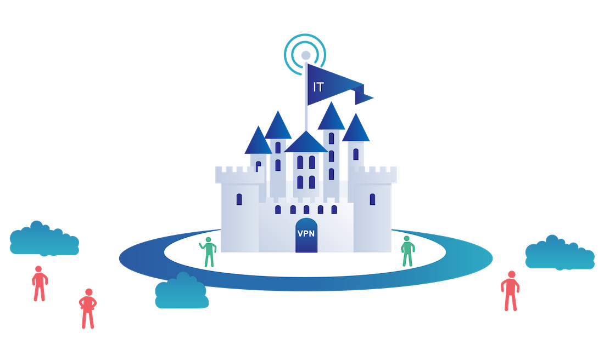
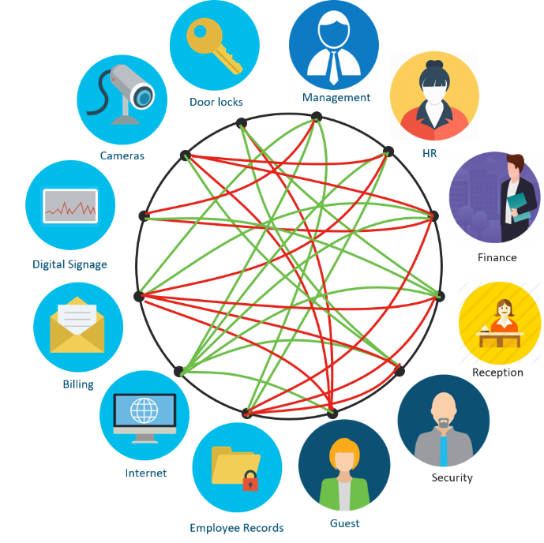
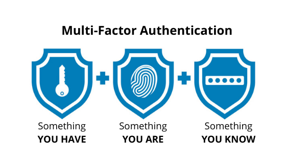
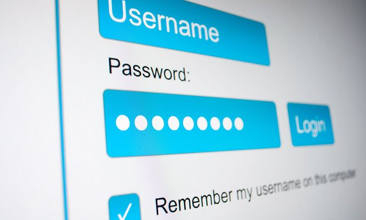
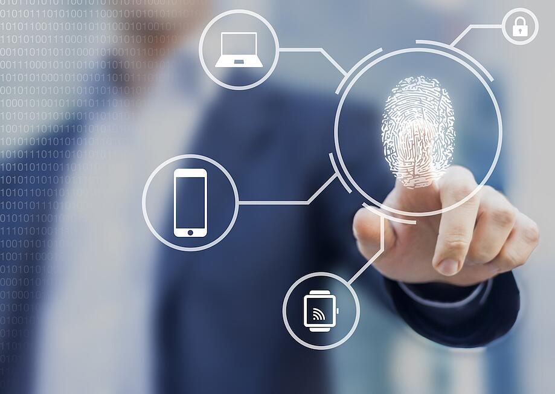

# Zero Trust : Identity

## The Traditional Model
การรักษาความปลอดภัยเครือข่ายในระบบ IT รูปแบบดั้งเดิมเป็นไปตามแนวคิดปราสาทและคูเมือง (castle-and-moat concept) ในการรักษาความปลอดภัยโดยอาศัยแนวคิดดังกล่าวทำให้ยากที่จะเข้าถึงระบบเครือข่ายจากภายนอก แต่ผู้ใช้งานทุกคนที่ได้รับสิทธิ์การใช้งานระบบเครือข่ายแล้วจะได้รับความไว้วางใจโดยทันที ปัญหาของแนวคิดนี้คือเมื่อผู้ไม่ประสงค์ดีเข้าถึงระบบเครือข่ายได้แล้วพวกเขาจะมีสิทธิ์ในการเข้าถึงทรัพยากรทั้งหมดที่อยู่ภายในได้โดยง่าย

{:height="75%" width="75%"}

## Zero Trust Security
Zero Trust Security เป็นรูปแบบการรักษาความปลอดภัยด้านไอทีที่ต้องการการยืนยันตัวตนสำหรับผู้ใช้งานทุกคนและทุกอุปกรณ์ที่พยายามเข้าถึงทรัพยากรบนเครือข่ายอย่างเข้มงวด ไม่ว่าจะอยู่ภายในหรือจากภายนอกองค์กรก็ตาม โดย Zero trust security เป็นแนวทางแบบองค์รวมในการรักษาความปลอดภัยเครือข่ายที่รวมเอาหลักการและเทคโนโลยีที่หลากหลายเข้าไว้ด้วยกัน ดังนั้น Zero Trust นั้นเป็นแค่แนวคิดภาพรวมซึ่งไม่ได้อ้างอิงกับเทคโนโลยีใด ส่วนแนวทางนั้นสุดแล้วแต่ผู้ใช้งานจะนำไปใช้ให้เหมาะสมในทางของตัวเอง

## What is the history of zero trust security?

แนวคิด Zero Trust ถูกสร้างโดย John Kindervag ในปี ค.ศ. 2010 และอีกหลายปีให้หลังทางบริษัท Google ก็ได้ออกมาประกาศว่าได้นำแนวคิดนี้มาใช้ภายใต้โปรเจ็ค ‘BeyondCorp’ และนอกจากนี้ก็มีทาง Gartner ที่ได้ออก Framework ที่เรียกว่า ‘Continuous Adaptive Risk and Trust Assessment หรือ “CARTA” ซึ่งมีแนวคิดเปลี่ยนการตัดสินใจการเข้าถึงที่พิจารณา Network Topology มาเป็นการพิสูจน์ตัวตนของผู้ใช้งานและอุปกรณ์แทน

## What are the main principles and technologies behind zero trust security?
Zero Trust เชื่อว่ามีผู้โจมตีทั้งภายในและภายนอกเครือข่าย ดังนั้นจึงไม่ควรเชื่อถือผู้ใช้งานหรืออุปกรณ์ใดโดยอัตโนมัติ
* Least-privilege การกำหนดสิทธิ์ในการเข้าถึงให้น้อยที่สุด ซึ่งหมายความว่าให้ผู้ใช้เข้าถึงได้มากเท่าที่ต้องการเท่านั้น
* Micro-segmentation คือการแบ่งขอบเขตความปลอดภัยออกเป็นโซนขนาดเล็ก เพื่อแบ่งสิทธิ์การเข้าถึงสำหรับส่วนต่างๆ ของระบบเครือข่าย บุคคลหรือโปรแกรมที่สามารถเข้าถึงโซนใดโซนหนึ่งจะไม่สามารถเข้าถึงโซนอื่นใดโดยไม่ได้รับอนุญาต

{:height="40%" width="40%"}

* Multi-factor Authentication การต้องการพิสูจน์ตัวตนโดยการใช้ปัจจัยหลายๆอย่างในการตรวจสอบและยืนยันตัวบุคคล เพื่ออนุญาตเข้าใช้งาน ซอฟต์แวร์ ระบบ หรือข้อมูลต่างๆ โดยทั่วไประบบ MFA จะเป็นการใช้เครื่องมือตั้งแต่ 2 อย่างขึ้นไปในการตรวจสอบและยืนยันความถูกต้อง

{:height="50%" width="50%"}

## What is identity in the context of computing?

ในการพิสูจน์ตัวตนระบบคอมพิวเตอร์จะประเมินผู้ใช้งานสำหรับลักษณะเฉพาะสำหรับพวกเขา หากตรงกันแสดงว่ามีการยืนยันตัวตนของผู้ใช้ คุณลักษณะเหล่านี้เรียกอีกอย่างว่า “Authentication Factors” 
ปัจจัยที่ใช้ในการตรวจสอบสิทธิ์ที่ใช้กันอย่างแพร่หลาย ได้แก่ :
* **Something the user knows**: ปัจจัยนี้เป็นความรู้ที่ผู้ใช้เพียงคนเดียวควรมี ที่มักนิยมกันอย่างแพร่หลานเช่น ชื่อผู้ใช้และรหัสผ่าน เป็นต้น

{:height="50%" width="50%"}

* **Something the user have**: เป็นการ Authentication นอกจากจะมี password ที่ต้องจำแล้วยังต้องใช้อุปกรณ์เสริมเข้ามาใช้ในการเข้าระบบด้วยเช่น บัตร ATM, RSA Token, Access card, Smart card เป็นต้น

{:height="50%" width="50%"}

* **Something the user are**: การนำเทคโนโลยี “Biometric” เข้ามาใช้ในการตรวจสอบตัวตนโดยอาศัยคุณสมบัติทางกายภาพของร่างกาย และมีลักษณะที่เป็น unique คือ ไม่ซ้ำกัน ได้แก่ ลายนิ้วมือ, ม่านตา เป็นต้น ตัวอย่างทั่วไปของปัจจัยในการตรวจสอบสิทธิ์นี้คือ Face ID ซึ่งเป็นคุณสมบัติที่นำเสนอโดยสมาร์ทโฟนสมัยใหม่จำนวนมาก

{:height="50%" width="50%"}

Reference:
* [https://www.cloudflare.com/en-ca/learning/access-management/what-is-identity-and-access-management/](https://www.cloudflare.com/en-ca/learning/access-management/what-is-identity-and-access-management/)
* https://www.techtalkthai.com/zero-trust-concept-and-how-to-in-practical-by-cisco/
* https://www.cloudflare.com/en-ca/learning/security/glossary/what-is-zero-trust