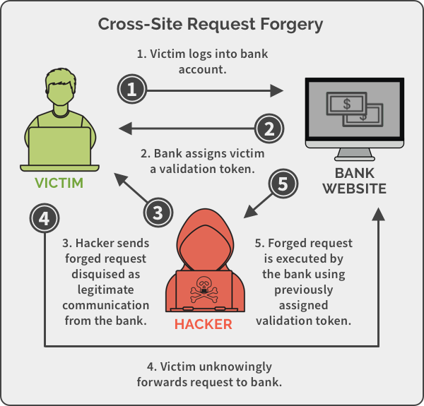

# Cross-site Request Forgery

การโจมตีแบบ Cross-site Request Forgery หรือ CSRF เป็นเทคนิคการโจมตีที่ผู้ไม่หวังดีนิยมใช้มากขึ้นเรื่อยๆ ซึ่งเป็นการโจมตีที่ใช้ประโยชน์จากความเชื่อของเว็บไซต์ที่มีต่อข้อมูล Input และเบราเซอร์จากผู้ใช้งาน กล่าวคือ เหยื่อจะถูกหลอกให้กระทำการบางอย่างบนเว็บไซต์ปกติทั่วไป ที่ก่อให้เกิดประโยชน์ต่อแฮ็คเกอร์ในนามของตัวเหยื่อเอง โดยที่ตัวเหยื่อไม่ต้องการกระทำหรือกระทำไปโดยไม่รู้ตัว

**CSRF คืออะไร**

การโจมตีแบบ CSRF จะใช้ “ตัวตน (Identity)” และ “สิทธิ์ (Privilege)” ของเหยื่อที่มีบนเว็บไซต์ ในการปลอมตัวเป็นเหยื่อและกระทำการหรือธุรกรรมไม่พึงประสงค์ แฮ็คเกอร์จะพยายามใช้ประโยชน์จากเหยื่อที่มี Login Cookies เก็บไว้ในเว็บเบราเซอร์ ส่งผลให้เว็บไซต์ที่ส่ง Cookie ไปเก็บข้อมูลการพิสูจน์ตัวตนของผู้ใช้มักตกเป็นเป้าหมายของการโจมตีนี้

การโจมตีแบบนี้ตรวจจับได้ยากเนื่องจากเป็นการกระทำธุรกรรมปกติในนามของเหยื่อเอง ทั้งข้อมูลการพิสูจน์ตัวตนและ IP  Address ต่างถูกนำมาใช้เพื่อยืนยันว่าเป็นการทำธุรกรรมจริง

**Sensitive Code Example**

สำหรับ Django application จะเกิดความไม่ปลอดภัยเมื่อ

* django.middleware.csrf.CsrfViewMiddleware ไม่ถูกเรียกใช้งานใน Django settings (setting.py):

* CSRF protection ถูกปิดการใช้งานใน View (views.py)

**Compliant Solution**
สำหรับ Django application

* แนะนำให้ป้องกันมุมมองทั้งหมดด้วยคำสั่ง django.middleware.csrf.CsrfViewMiddleware ใน setting.py

* และไม่ปิดใช้งานการป้องกัน CSRF ใน views.py

**Reference:**
* [https://rules.sonarsource.com/python/type/Security%20Hotspot/RSPEC-4502](https://rules.sonarsource.com/python/type/Security%20Hotspot/RSPEC-4502)
* [https://www.techtalkthai.com/how-to-prevent-csrf/](https://www.techtalkthai.com/how-to-prevent-csrf/)

**Team Author:** Ekawut Chairat
