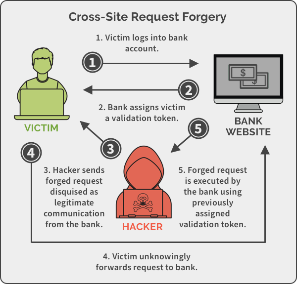

# Cross Site Request Forgery Protection in Django

## Django Web Framework

{:height="75%" width="75%"}

Django เป็นการพัฒนาเว็บแอพพลิเคชั่นโดยใช้ภาษา Python ซึ่งกำลังได้รับความนิยมกันเป็นอย่างมากในปัจจุบัน สามารถเข้าใจและพัฒนาเว็บแอพพลิเคชั่นได้อย่างรวดเร็ว เนื่องจากภาษา Python เป็นภาษาที่ไม่ซับซ้อน มีโครงการการพัฒนา Web Framework ในรูปแบบ Model Template View (MTV)

{:height="75%" width="75%"}

* Model คือส่วนของที่เก็บข้อมูลของแอพพลิเคชั่น
* View เป็นส่วนสำหรับประมวลผลคำสั่ง จัดการกับข้อมูลที่รับมาจาก Template หรือจัดการกับข้อมูลใน Model เพื่อนำผลลัพธ์กลับไปแสดงผลในส่วนของ Template
* Template คือส่วนของการแสดงผลข้อมูลผลลัพธ์จากการประมวลผลใน View ซึ่งจะถูกส่งข้อมูลในรูปแบบ Context มาแสดงผลในหน้าเว็บร่วมกับ HTML



## CSRF คืออะไร

CSRF ย่อมาจาก Cross Site Request Forgery (CSRF) เป็นเทคนิคการโจมตีที่ผู้ไม่หวังดีนิยมใช้มากขึ้นเรื่อยๆ ซึ่งเป็นการโจมตีที่ใช้ประโยชน์จากความเชื่อของเว็บไซต์ที่มีต่อข้อมูล Input และ Web browser จากผู้ใช้งาน คือ เหยื่อจะถูกหลอกให้กระทำการบางอย่างบนเว็บไซต์ปกติทั่วไป ที่ก่อให้เกิดประโยชน์ต่อ Hacker หรือผู้ไม่หวังดีในนามของตัวเหยื่อเอง โดยที่ตัวเหยื่อไม่ต้องการกระทำหรือกระทำไปโดยไม่รู้ตัว

การโจมตีแบบ CSRF จะใช้ “ตัวตน (Identity)” และ “สิทธิ์ (Privilege)” ของเหยื่อที่มีบนเว็บไซต์ ในการปลอมตัวเป็นเหยื่อและกระทำการหรือธุรกรรมไม่พึงประสงค์ Hacker จะพยายามใช้ประโยชน์จากเหยื่อที่มี Login Cookies เก็บไว้ใน  Web browser ส่งผลให้เว็บไซต์ที่ส่ง Cookie ไปเก็บข้อมูลการพิสูจน์ตัวตนของผู้ใช้มักตกเป็นเป้าหมายของการโจมตีนี้

ลักษณะโจมตีแบบนี้ตรวจจับได้ค่อนข้างยากเนื่องจากเป็นการกระทำธุรกรรมปกติในนามของเหยื่อเอง ทั้งข้อมูลการพิสูจน์ตัวตนและ IP  Address ต่างถูกนำมาใช้เพื่อยืนยันว่าเป็นการทำธุรกรรมของเหยื่อจริง

**สำหรับ Django application จะเกิดความไม่ปลอดภัยเมื่อ**

* django.middleware.csrf.CsrfViewMiddleware ไม่ถูกเรียกใช้งานใน MIDDLEWARE setting ภายใน setting.py :

``` python
# setting.py
MIDDLEWARE = [
    'django.middleware.security.SecurityMiddleware',
    'django.contrib.sessions.middleware.SessionMiddleware',
    'django.middleware.common.CommonMiddleware',
    'django.contrib.auth.middleware.AuthenticationMiddleware',
    'django.contrib.messages.middleware.MessageMiddleware',
    'django.middleware.clickjacking.XFrameOptionsMiddleware',
]
ROOT_URLCONF = 'code4sec.urls'
```

* CSRF protection ถูกปิดการใช้งานใน View (views.py)

``` python
# view.py
@csrf_exempt
class HomePageView(TemplateView):
    def get(self, request, **kwargs):
        return render(request, 'index.html', context=None)
```

**How to use it**
สำหรับ Django application

* แนะนำให้ป้องกัน view ทั้งหมดด้วยคำสั่ง django.middleware.csrf.CsrfViewMiddleware ในไฟล์ setting.py หรือใช้ csrf_protect () กับเฉพาะ view ที่ต้องการได้แต่ไม่แนะนำให้ใช้งานวิธีนี้

``` python
# setting.py
MIDDLEWARE = [
    'django.middleware.security.SecurityMiddleware',
    'django.contrib.sessions.middleware.SessionMiddleware',
    'django.middleware.common.CommonMiddleware',
    'django.middleware.csrf.CsrfViewMiddleware',    # << Code4Sec
    'django.contrib.auth.middleware.AuthenticationMiddleware',
    'django.contrib.messages.middleware.MessageMiddleware',
    'django.middleware.clickjacking.XFrameOptionsMiddleware',
]
ROOT_URLCONF = 'code4sec.urls'
```

* สำหรับทุก template ที่มีการใช้งาน POST form ให้ทำการเรียกใช้งาน csrf_token ภายใน form 

* ตรวจสอบว่ามีการเรียกใช้งาน RequestContext เพื่อ render ค่า response ให้กับ csrf_token ทำงานได้อย่างถูกต้อง หากคุณกำลังใช้ฟังก์ชัน render () มุมมองทั่วไปหรือแอปที่มีส่วนร่วมคุณจะได้รับความคุ้มครองอยู่แล้วเนื่องจากสิ่งเหล่านี้ใช้ RequestContext

* และไม่ปิดใช้งานการป้องกัน CSRF ใน views.py 

``` python
# view.py
class HomePageView(TemplateView):
    def get(self, request, **kwargs):
        return render(request, 'index.html', context=None)
```

**How it work ?**
* Cookie จะถูก set โดย CsrfViewMiddleware ด้วยฟังก์ชั่น django.middleware.csrf.get_token() ซึ่งเป็นฟังก์ชั่นเพื่อดึงค่า CSRF token และถูกส่งไปกับทุก response 
* ทำการซ่อนข้อมูลจาก form field ด้วย "csrfmiddlewaretoken" อยู่ในรูปแบบ POST โดยอาศัย get_token() เพื่อให้ form field เปลี่ยนแปลงในทุกการ response
* สำหรับ incoming requests ทั้งหมดที่ไม่ได้ใช้ HTTP GET, HEAD, OPTIONS หรือ TRACE จะต้องมี CSRF cookie และ "csrfmiddlewaretoken" ถูกใช้งานอย่างถูกต้อง

**Reference:**
* [https://docs.djangoproject.com/en/3.1/ref/csrf/](https://docs.djangoproject.com/en/3.1/ref/csrf/)
* [https://rules.sonarsource.com/python/type/Security%20Hotspot/RSPEC-4502](https://rules.sonarsource.com/python/type/Security%20Hotspot/RSPEC-4502)

**Author:**
 
Ekawut Chairat
