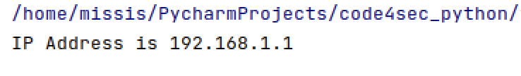

# Hard-coded credentials are security-sensitive

#Code4Sec Week #Day4 #NEIS0736 #NECS0736

ถ้าเราพูดถึงการพัฒนาโปรแกรมในปัจจุบันโดยมีการ hardcoding ข้อมูล security-sensitive เช่น username, password, IP address จะส่งผลต่อความปลอดภัยของ application ผู้ไม่หวังดีอาจ decompile code และด้วยเหตุนี้อาจทำให้ผู้ไม่หวังดีค้นพบข้อมูล sensitive ภายใน code ของเราได้ หลังจากนั้นผู้ไม่หวังดีสามารถโจมตีรูปแบบต่างๆ เช่น Denial of Service ไปยัง IP Address หรือทำการโจมตีด้วย IP address spoofing จาก IP Address ที่พบใน code ได้ อีกทั้งในปัจจุบันมีสถาปัตยกรรมที่เปลี่ยนแปลงตลอดอยู่เวลาเนื่องจากความต้องการด้าน scaling และ redundancy อาจทำให้เกิดความผิดพลาด เมื่อมีการเปลี่ยนแปลง IP Address และ การทำ hardcoding จะต้องแก้ไขด้วยซึ่งจะมีผลกระทบต่อการพัฒนาโปรแกรม การจัดส่ง และการปรับใช้งานอีกด้วย


**ตัวอย่างการ hardcoding**
``` python
import socket

#Code4Sec
ip = '192.168.12.42'
sock = socket.socket()
sock.bind((ip, 9090))
```
จากตัวอย่างมีการ hardcoding ค่า IP Address ไว้ใน code ของโปรแกรม หากผู้ไม่หวังดีสามารถเข้าถึง code ได้ เราจะมีความเสี่ยงด้านความมั่นคงปลอดภัยทันที

**ตัวอย่างการใช้งาน ConfigParser**

สำหรับ ConfigParser class มีพื้นฐานคล้ายกับการทำ configuration file ที่ใช้กันใน Microsoft Windows แบบไฟล์ INI ในภาษา Python เราก็พัฒนาโปรแกรมโดยใช้ configuration file แบบง่ายได้ด้วย module นี้ 


``` python
from configparser import ConfigParser

#Read config.ini file
config_object = ConfigParser()
config_object.read("config.ini")

#Get the password
serverinfo = config_object["CODE4SEC"]
ipaddress = serverinfo["ipaddr"]

print("IP Address is", ipaddress)
```
เราลองนำ ConfigParser Module มาใช้งานแทนการใช้ hardcoding โดยทำการ "import ConfigParser" เข้ามาในโปรแกรม โดยอันดับแรกเราจะสร้าง Configuration File ที่ประกอบด้วย หนึ่งหรือหลาย Sections โดยใช้เครื่องหมายวงเล็บเปิดและปิด [section_name] โดยในแต่ละ Section จะมี Key และ Value ที่คั่นด้วยเครื่องหมาย "=" หรือ ":" เช่น  host = test.com หรือ host : test.com

``` ini
# config.ini

[CODE4SEC]
hostname = test.com
port = 8080
ipaddr = 192.168.1.1
```

จากตัวอย่างเราจะทำการสร้าง configuration file ชื่อว่า config.ini ไว้ใน directory เดียวกันกับตัวโปรแกรม โดยใน file จะมีข้อมูล จะมี Section ชื่อว่า CODE4SEC ประกอบด้วย Key และ Value ของค่า host, IP address และ port อยู่ และใช้คำสั่ง config_object.read("config.ini") เพื่อทำการอ่านข้อมูล และใช้คำสั่ง serverinfo = config_object["CODE4SEC"] เพื่อเรียก section ชื่อ CODE4SEC และ ipaddress = serverinfo["ipaddr"] เพื่อนำ Key และ Value ของ ipaddr มาใช้งานได้เลย

{:height="75%" width="75%"}

ข้อดีของการใช้งาน ConfigParser
* นักพัฒนาจะต้องทำการแก้ไขทุกครั้งที่เกิดเหตุการณ์นี้แทนที่จะให้ทีมปฏิบัติการเปลี่ยน config file
* สามารถบังคับให้ใช้ค่า configuration เดียวกันในทุก environment ได้ (dev, sys, qa, prod)

**Reference:**
* [https://docs.python.org/3/library/configparser.html](https://docs.python.org/3/library/configparser.html)

**Team Author:** 

Ekawut Chairat