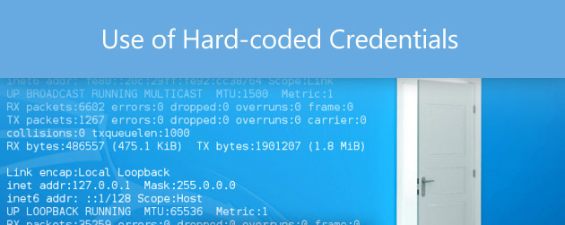

# Day X - Hard-coded credentials are security-sensitive

การพัฒนาโปรแกรมโดยมีการ hardcoding ข้อมูล security-sensitive เช่น username, password, IP address 

การให้บริการในปัจจุบันมีสถาปัตยกรรมที่เปลี่ยนแปลงตลอดอยู่เวลาเนื่องจากความต้องการด้าน scaling และ redundancy ซึ่งทำให้เกิดความผิดพลาด เมื่อมีการเปลี่ยนแปลง IP Address และ การทำ hardcoding จะต้องแก้ไขด้วยซึ่งจะมีผลกระทบต่อการพัฒนาโปรแกรม การจัดส่ง และการปรับใช้งานอีกด้วย

* นักพัฒนาจะต้องทำการแก้ไขทุกครั้งที่เกิดเหตุการณ์นี้แทนที่จะให้ทีมปฏิบัติการเปลี่ยน config file
* สามารถบังคับให้ใช้ค่า configuration เดียวกันในทุก environment ได้ (dev, sys, qa, prod)

สุดท้ายการ hardcoding มีผลต่อความปลอดภัยของแอปพลิเคชัน ผู้ไม่หวังดีอาจถอดรหัสโค้ดได้ (decompile) และด้วยเหตุนี้อาจทำให้ผู้ไม่หวังดีค้นพบข้อมูล sensitive ภายใน code ของเราได้ ผู้ไม่หวังดีสามารถโจมตีแบบ Denial of Service ไปยัง IP Address หรือทำการโจมตีด้วย IP address spoofing จาก IP Address ที่พบใน code ได้



**Sensitive Code Example**
``` python
import socket

#Code4Sec
ip = '192.168.12.42'
sock = socket.socket()
sock.bind((ip, 9090))
```

**Compliant Solution**


``` python
from configparser import ConfigParser

#Read config.ini file
config_object = ConfigParser()
config_object.read("config.ini")

#Get the password
serverinfo = config_object["CODE4SEC"]
print("Password is {}".format(serverinfo["ipaddr"]))
```

Reference: 
* [https://standard.etda.or.th/wp-content/uploads/2018/09/20150405-ER-WAS-V07-33-R1.pdf](https://standard.etda.or.th/wp-content/uploads/2018/09/20150405-ER-WAS-V07-33-R1.pdf)
* [https://docs.python.org/3/library/shlex.html](https://docs.python.org/3/library/shlex.html)
* [https://www.linkedin.com/pulse/os-command-injection-from-pythondjango-perspective-jerin-jose](https://www.linkedin.com/pulse/os-command-injection-from-pythondjango-perspective-jerin-jose)

**Team Author:** Ekawut Chairat

### Code4Sec