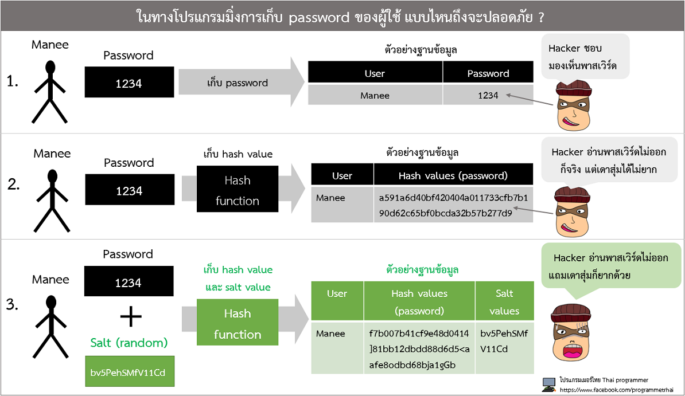
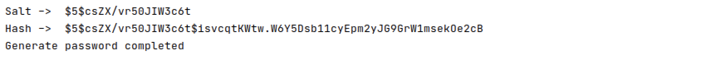

#  Adding salt to hashing with crypt module

#Code4Sec Week #Day3 #NEIS0736 #NECS0736

## What is a salt?

{:height="75%" width="75%"}


**Salt** เป็นเทคนิคสำหรับเพิ่มความปลอดภัยให้กับข้อมูลของเรา ซึ่งทำให้ใช้เวลาในการถอดรหัสมากขึ้น โดยมีผลกระทบกับผู้ใช้งานน้อย โดยเป็นการเพิ่มข้อมูลที่ถูกสุ่มขึ้นมาจำนวนหนึ่งเข้าไปในรหัสผ่านที่ผู้ใช้งานป้อนก่อนจะนำไป Hash ซึ่งข้อมูลชุดที่เพิ่มขึ้นมานี้ถูกเรียกว่า Salt ตัวอย่างเช่น เมื่อผู้ใช้งานตั้งค่ารหัสผ่านขึ้นมาเป็น “password123” ซึ่งมีความยาว 11 ตัวอักษร ระบบจะทำการสุ่มค่า Salt ขึ้นมาค่าหนึ่ง สมมุติให้เป็นค่า “qazws101” ซึ่งมีความยาว 8 ตัวอักษร ก่อนที่จะนำรหัสผ่านไปเก็บระบบจะนำ password กับ salt มาต่อกันแล้วจึงหา Hash ซึ่งจะเท่ากับ Hash นี้มีค่าตั้งต้นถึง 19 ตัวอักษร ซึ่งต้องใช้เวลาในการถอดรหัสนานกว่า Hash ของรหัสผ่านเดิมที่ไม่มีการใช้ salt มาก ถึงแม้ว่าผู้ไม่ประสงค์ดีจะสามารถอ่านค่า Salt ของแต่ละรหัสผ่านได้โดยตรง แต่ก็ไม่ได้ช่วยให้การสุ่มหารหัสผ่านที่ถูกต้องได้ง่ายมากขึ้น เพราะอุปสรรคของการถอดรหัสค่า Hash อยู่ที่จำนวนครั้งที่ต้องคำนวณ Hash เป็นสำคัญ ในกรณีที่ให้รหัสผ่านเป็นตัวอักษรตัวเล็ก ตัวใหญ่ และตัวเลขเท่านั้น ซึ่งจะมีความเป็นไปได้ 62 แบบ จะเท่ากับว่า ถ้ารหัสผ่านยาว 14 ตัวอักษร ผู้ไม่ประสงค์ดีอาจต้อง Hash ถึง 62^11 ครั้ง ถึงจะได้ค่ารหัสผ่านที่ถูกต้อง แต่ถ้าเพิ่ม Salt เข้าไปอีก 8 ตัวอักษร จำนวนครั้งที่อาจต้องใช้จะมีถึง 62^19 ครั้ง ซึ่งต่างกันหลายเท่าเป็นเวลาที่เพิ่มขึ้นอย่างมากเลยทีเดียว

{:height="75%" width="75%"}

แนวทางปฏิบัติในการเข้ารหัสอย่างปลอดภัยที่แนะนำคือ ใช้ Hash function ที่สร้างสามารถสร้าง Salt ของตัวเอง หรือสร้าง Salt แบบสุ่มยาวอย่างน้อย 32 bytes

**Noncompliant Code Example**

hashlib

``` python
from hashlib import pbkdf2_hmac

# password ตัวอย่าง
password = b'Password123'

hash = pbkdf2_hmac('sha256', password, b'TswS7e2!o9#E', 100000)    # Noncompliant: salt is hardcoded
```
จากตัวอย่างเป็นการเขียน code ที่ไม่ปลอดภัยเนื่องจากมีการ hardcoded ของค่า salt ไว้

crypt
``` python
import crypt

# password ตัวอย่าง
password = 'Password123'

hash = crypt.crypt(password)         # Noncompliant: salt is not provided
```
จากตัวอย่างเป็นการเขียน code ที่ไม่ปลอดภัยเนื่องจากมีการไม่มีการใช้งาน salt

**Compliant Solution**

hashlib

``` python
import os
from hashlib import pbkdf2_hmac

# example password
password = 'Code4SecWeek'

salt = os.urandom(32)
print('Salt -> ', salt)

hash = pbkdf2_hmac('sha256', password, salt, 100000)    # Compliant
print('Hash -> ', hash)

print('Generate password completed')
```

crypt
``` python
import crypt
import os
from hashlib import pbkdf2_hmac

# example password
password = 'Code4SecWeek'

salt = crypt.mksalt(crypt.METHOD_SHA256)
print('Salt -> ', salt)

hash = crypt.crypt(password, salt)         # Compliant
print('Hash -> ', hash)

print('Generate password completed')
```

เมื่อเราลอง import crypt เข้ามาในโปรแกรม เพื่อทำการ generate ค่า salt แบบ random ด้วยคำสั่ง "crypt.mksalt(crypt.METHOD_SHA256)" โปรแกรมจะนำค่า Salt และค่า Hash ของ password มาต่อกัน ซึ่งต้องใช้เวลาในการถอดรหัสนานกว่า Hash ของรหัสผ่านเดิมมากขึ้นอย่างมหาศาลเลยทีเดียว



**Conclusion**
* การเก็บข้อมูลที่สำคัญ เช่น รหัสผ่าน, เลขประจำตัวประชาชน ในฐานข้อมูล ควรเก็บในรูปแบบ Hash
* รหัสผ่านยิ่งยาว จะยิ่งใช้เวลาในการถอดรหัสมากขึ้น และยิ่งมีการใช้ Salt ก็จะใช้เวลามากยิ่งขึ้น
* ทางที่ดีที่สุดคือ อย่าให้รหัสผ่านหรือข้อมูลความลับที่เก็บอยู่ ถูกเข้าถึงจากผู้ที่ไม่ได้รับอนุญาต

**Reference:**
* [https://rules.sonarsource.com/python/type/Vulnerability/RSPEC-2053](https://rules.sonarsource.com/python/type/Vulnerability/RSPEC-2053)
* [https://www.thaicert.or.th/papers/technical/2012/pa2012te013.html](https://www.thaicert.or.th/papers/technical/2012/pa2012te013.html)

**Author:** Ekawut Chairat

### Code4Sec