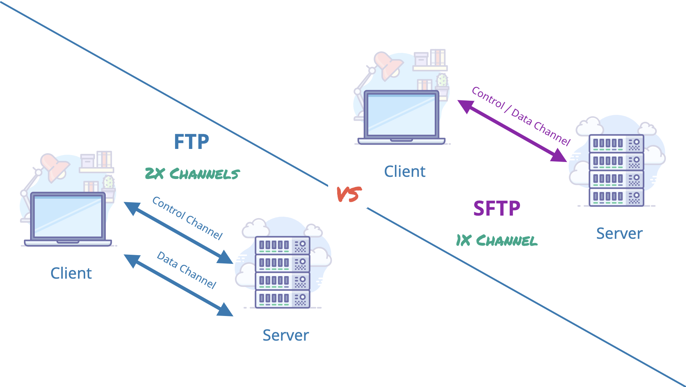
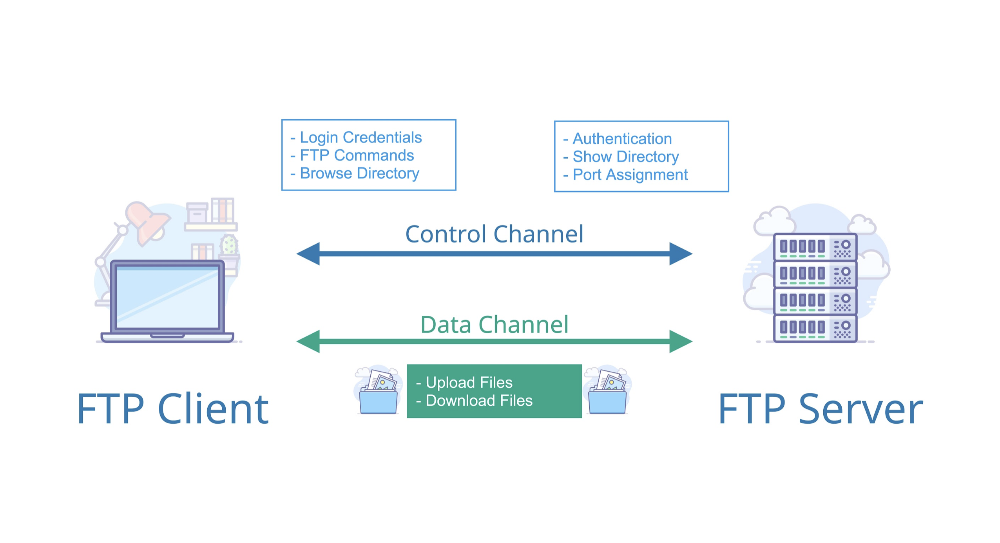

# FTP_TLS adding TLS support to FTP

#Code4Sec Week #Day7 #NEIS0736 #NECS0736

## FTP - Clear-text protocols

**FTP (File Transfer Protocol)** คือ Protocol ที่ออกแบบมาเพื่อใช้ในการรับส่งไฟล์ระหว่าง Client และ Server โดยจะมี port ที่ใช้งานอยู่ 2 port คือ port 20 ใช้ในการรับ-ส่งข้อมูล (data channel) ส่วนอีก port คือ port 21 ใช้ในการควบคุมหรือส่งคำสั่ง FTP (control channel) เช่น ตรวจสอบการเข้าถึงโปรแกรมจากผู้ใช้งาน เป็นต้น และในปัจจุบัน ผู้ให้บริการ service ต่างๆ โดยส่วนใหญ่มักจะให้บริการแลกเปลี่ยนไฟล์ผ่าน FTP Server เพราะการติดตั้งระบบและการบริหารจัดการไฟล์ทำได้ง่าย

{:height="75%" width="75%"}

แต่ FTP เป็นโพรโตคอลที่รับ-ส่งข้อมูลโดยไม่มีการเข้ารหัสลับ จึงทำให้ข้อมูลที่รับ-ส่ง เช่น Username หรือ Password สามารถถูกดักจับ (Sniff) จากผู้ไม่ประสงค์ดีได้ 

{:height="75%" width="75%"}

ซึ่งโปรโตคอลเหล่านี้ไม่ปลอดภัยเนื่องจากทำให้แอปพลิเคชั่นเกิดความเสี่ยงต่างๆ เช่น
* Sensitive data exposure
* Traffic redirected to a malicious endpoint
* Malware infected software update or installer
* Execution of client side code
* Corruption of critical information

วิธีการแก้ไขนั้นควรเปลี่ยนมาใช้ Protocol สำหรับแลกเปลี่ยนข้อมูลที่มีการเข้ารหัสลับข้อมูลที่รับส่งเสมอ ซึ่งมีโพรโทคอลที่ถูกออกแบบมาเพื่อแก้ปัญหาดังกล่าว คือ FTPS

## ftplib — FTP protocol client

FTP Module กำหนด FTP Class และรายละเอียดที่เกี่ยวข้อง เราสามารถใช้งาน module นี้เพื่อเขียนโปรแกรม Python ที่ทำงาน FTP แบบอัตโนมัติต่างๆ เช่น การทำ FTP mirroring นอกจากนี้ยังใช้งานร่วมกับ urllib.request เพื่อจัดการ URL ที่ใช้ FTP ได้อีกด้วย สำหรับข้อมูลเพิ่มเติมเกี่ยวกับ FTP (File Transfer Protocol) ดูข้อมูลได้ที่ [RFC 959](https://tools.ietf.org/html/rfc959.html)

class ftplib.FTP(host='', user='', passwd='', acct='', timeout=None, source_address=None, *, encoding='utf-8')

ตัวอย่าง FTP Objects

**FTP.login(user='anonymous', passwd='', acct='')**

Log in ด้วย username และ password ที่ระยุ

**FTP.sendcmd(cmd)**

ส่งคำสั่งไปยัง FTP Server และตอบกลับ response รูปแบบ string

**FTP.transfercmd(cmd, rest=None)**

ทำการ transfer ข้อมูลผ่่าน data connection

## Add TLS support to FTP

class ftplib.FTP_TLS(host='', user='', passwd='', acct='', keyfile=None, certfile=None, context=None, timeout=None, source_address=None, *, encoding='utf-8')

FTP subclass เป็นการเพิ่มการสนับสนุน TLS ให้กับ FTP ตามที่อธิบายไว้ใน [RFC 4217](https://tools.ietf.org/html/rfc4217.html) เชื่อมต่อกับ port 21 เพื่อรักษาความปลอดภัย FTP control connection ก่อนที่จะทำการพิสูจน์ตัวตน สำหรับการรักษาความปลอดภัยของ data connection ต้องถูกระบุเรียกใช้ ``` prot_p () ``` 
method และ context คือ ssl.SSLContext object ที่อนุญาตให้รวม SSL configuration options, certificates และ private keys ไว้ในโครงสร้างเดียวกัน

{:height="75%" width="75%"}

## FTP_TLS Objects

```FTP_TLS class``` เป็นการ inherits มาจาก FTP โดยมีการเพิ่ม object ไว้ดังนี้:

**FTP_TLS.ssl_version**

SSL version ที่ต้องการใช้งาน (defaults to ssl.PROTOCOL_SSLv23).

**FTP_TLS.auth()**

ตั้งค่า secure control connection โดยสามารถใช้งาน TLS หรือ SSL ขึ้นอยู่กับการระบุในแอตทริบิวต์ ssl_version

**FTP_TLS.ccc()**

เปลี่ยนค่า control channel ให้กลับเป็นแบบ plaintext ใช้ประโยชน์จากไฟร์วอลล์ที่รู้วิธีจัดการ NAT ด้วย non-secure FTP โดยไม่ต้องเปิดพอร์ตถาวร

**FTP_TLS.prot_p()**

ตั้งค่า secure data connection.

**FTP_TLS.prot_c()**

ตั้งค่า data connection แบบ clear text

**ตัวอย่างการใช้งาน FTP_TLS**

``` python
from ftplib import FTP_TLS

ftps = FTP_TLS(host='ftp.pureftpd.org')
print(ftps.login())
ftps.prot_p()
print(ftps.retrlines('LIST'))
```

**Result :**

```
/home/missis/PycharmProjects/code4sec_python/venv/bin/python /home/missis/PycharmProjects/code4sec_python/main.py
230 Anonymous user logged in
drwxr-xr-x   18 1000       1008             1024 Jul 21  2016 .
drwxr-xr-x   18 1000       1008             1024 Jul 21  2016 ..
lrwxr-xr-x    1 1000       20                 20 Jun 20  2011 6jack -> pure-ftpd/misc/6jack
...
drwx--x--x    4 1000       1008              512 Jan 11 01:30 tmp
lrwxr-xr-x    1 0          1008               15 Feb  1  2006 ucarp -> pure-ftpd/ucarp
226-Options: -a -l 
226 40 matches total
```

Reference: 
* [https://docs.python.org/3/library/ftplib.html#ftp-tls-objects](https://docs.python.org/3/library/ftplib.html#ftp-tls-objects)

**Author:**

Ekawut Chairat
