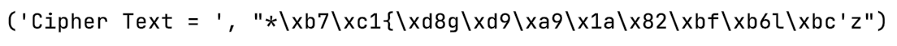
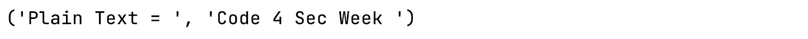

# Symmetric Key Algorithms with Wolfcrypt

### **#Code4Sec Week #Day2 #NEIS0736 #NECS0736**

## Symmetric-key Cryptography

การเข้ารหัสแบบสมมาตร (Symmetric-key Cryptography) เป็นการเข้ารหัสที่ใช้ Key ชุดเดียวกันทั้งผู้ส่งและผู้รับในการเข้ารหัสและถอดรหัสลับ จากสาเหตุนี้จึงเป็นที่มาของชื่อระบบรหัสแบบสมมาตรเป็นการอธิบายถึงความเท่ากันหรือเหมือนกันของทั้งสองข้าง   Key ซึ่งอยู่ในรูปรหัสเป็นตัวแปรสำคัญสำหรับการเข้าและถอดรหัสลับข้อมูล ซึ่งขนาดของ Key มีหน่วยเป็น bit จะแสดงถึงระดับความปลอดภัยของข้อมูลที่ได้รับการเข้ารหัสลับ โดยการใช้ Key ที่มีความยาวหรือจำนวนบิตมาก จะทำให้การเข้ารหัสลับข้อมูลนั้นมีความปลอดภัยมากยิ่งขึ้นอีกด้วย


ที่นี่เรามาลองทำ Symmetric-key Cryptography ด้วย Wolfcrypt จากภาษา Python กันเลย

ในตัวอย่างจะเป็นการเข้ารหัส Symmetric-key Cryptography แบบ Advanced Encryption Standard หรือ AES โดย wolfcrypt.ciphers มี class ที่สามารถเรียกใช้งานกันได้เลย

``` python 
class Aes(_Cipher):
    """
    The **Advanced Encryption Standard** (AES), a.k.a. Rijndael, is
    a symmetric-key cipher standardized by **NIST**.
    """
    block_size = 16
    key_size = None  # 16, 24, 32
    _key_sizes = [16, 24, 32]
    _native_type = "Aes *"

    def _set_key(self, direction):
        if direction == _ENCRYPTION:
            return _lib.wc_AesSetKey(
                self._enc, self._key, len(self._key), self._IV, _ENCRYPTION)

        return _lib.wc_AesSetKey(
            self._dec, self._key, len(self._key), self._IV, _DECRYPTION)

    def _encrypt(self, destination, source):
        return _lib.wc_AesCbcEncrypt(self._enc, destination,
                                     source, len(source))

    def _decrypt(self, destination, source):
        return _lib.wc_AesCbcDecrypt(self._dec, destination,

                                     source, len(source))
```

**AES**

``` python
class wolfcrypt.ciphers.Aes(key, mode, IV=None)
```
The Advanced Encryption Standard (AES), a.k.a. Rijndael, is a symmetric-key cipher standardized by NIST.

โดยสิ่งที่เราต้องระบุให้กับ Aes คือ 

key = neis0736necs0736

mode = MODE_CBC

IV=0123456789abcdef

และข้อมูลที่เราจะทำการ encrypt คือคำว่า "Code 4 Sec Week "

**Encrypt:**

``` python
from wolfcrypt.ciphers import Aes, MODE_CBC

cipher = Aes(b'neis0736necs0736', MODE_CBC, b'0123456789abcdef')

# Encrypt
ciphertext = cipher.encrypt('Code 4 Sec Week ')
print('Cipher Text = ', ciphertext)
```

**Result:**


จะเห็นว่า wolfcrypt จะทำการ encrypt คำว่า "Code 4 Sec Week " ให้เป็น cipher text ที่ถูกเข้ารหัสด้วย key ที่เราระบุ จะได้ผลลัพธ์จากการเข้ารหัสเป็น cipher text ที่อ่านไม่ออกแบบด้านบน จะทำให้เราสามารถส่งหรือจัดเก็บข้อมูลได้อย่างปลอดภัย

**Decrypt:**

หากเรารู้ key สำหรับเข้ารหัส ก็จะสามารถทำการถอดรหัสข้อมูลได้ จากตัวอย่าง key = neis0736necs0736 มาลองถอดรหัสข้อมูลจาก cipher text ที่มีกันเลย

``` python
from wolfcrypt.ciphers import Aes, MODE_CBC

cipher = Aes(b'neis0736necs0736', MODE_CBC, b'0123456789abcdef')

# Decrypt
ciphertext = "*\xb7\xc1{\xd8g\xd9\xa9\x1a\x82\xbf\xb6l\xbc'z"
plaintext = cipher.decrypt(ciphertext)
print('Plain Text = ', plaintext)
``` 

**Result:**


หลังจากการ decrypt ข้อมูล cipher text ด้วย key ที่เรารู้ เราจะได้ plain text เป็นข้อมูลเดิม คือ คำว่า "Code 4 Sec Week " ตามหลักการของ Symmetric-key Cryptography

**จะเห็นได้ว่า Key เป็นสิ่งที่มีความสำคัญในการเข้ารหัสและถอดรหัสข้อมูล จึงเป็นสิ่งที่ควรเป็นความลับเฉพาะเท่านั้น หากมีผู้อื่นรู้ Key ของเราก็จะถอดรหัสข้อมูลได้เช่นกัน...ความลับก็จะไม่เป็นความลับอีกต่อไป...**

Reference: 
* [https://wolfssl.github.io/wolfcrypt-py/symmetric.html](https://wolfssl.github.io/wolfcrypt-py/symmetric.html)

**Team Author:** 

Ekawut Chairat