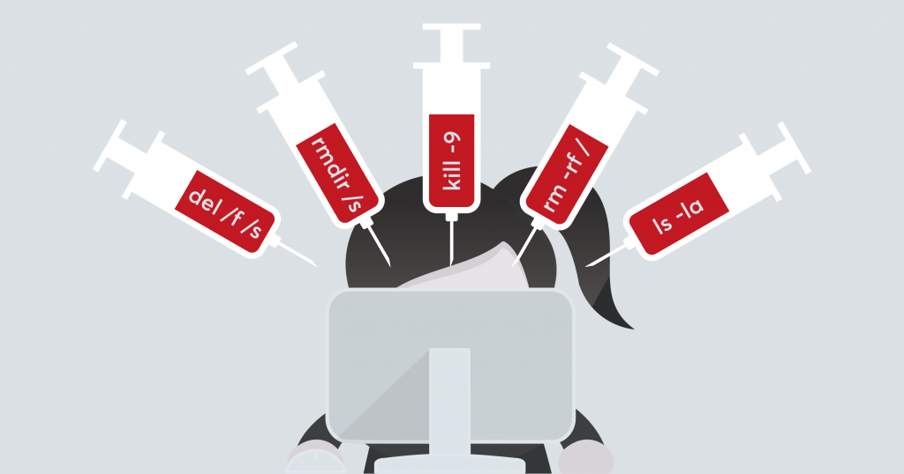
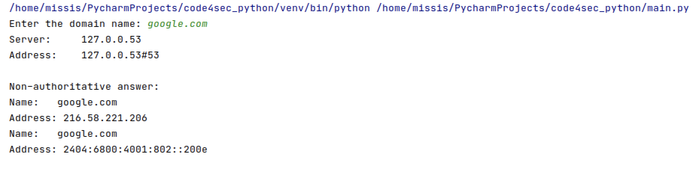
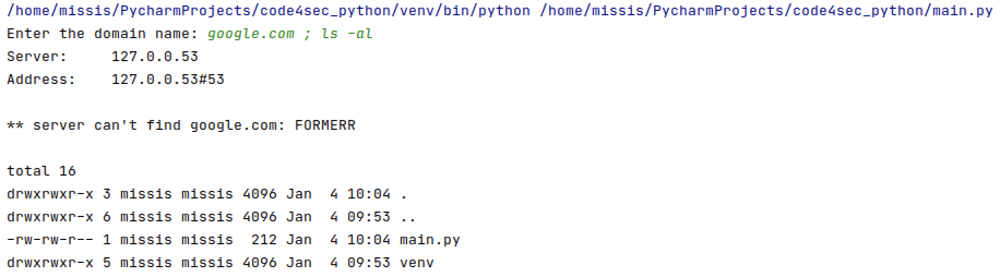
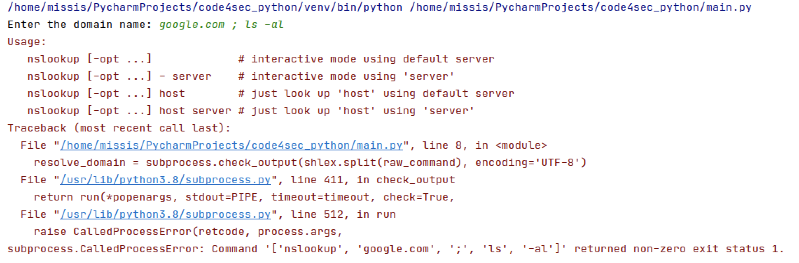

# How to use two-step verification with your Microsoft account

## OS Command Injection
หากเรามีการพัฒนาโปรแกรมที่มีการใช้คำสั่ง (OS Command) เช่น exec(), shell_exec(), open(), nslookup() ร่วมกับการพัฒนาโปรแกรม จะทำให้เกิดช่องโหว่ที่ทำให้ผู้ไม่หวังดีสามารถโจมตีผ่านคำสั่งระดับระบบปฏิบัติการ เผื่อสามารถสั่งดำเนินการใดๆ ผ่านโปรแกรมที่มีช่องโหว่ได้ ซึ่งอาจจะนำไปสู่การรั่วไหลของข้อมูล เข้าควบคุมเครื่อง หรือใช้เป็นฐานเพื่อโจมตีไปยังเครื่องอื่นๆ ได้ ซึ่งช่องโหว่นี้ถูกเรียนกันว่า "OS Command Injection Vulnerability" และการโจมตีที่อาศัยข่องโหว่นี้เรียกว่า "OS Command Injection Attack"



ปัญหาสามารถบรรเทาได้ด้วยวิธีใด ๆ ต่อไปนี้:
* ใช้งาน subprocess module โดยไม่มี shell = true ทำให้ subprocess แยก command array และ argument array ออกจากกันอย่างชัดเจน
* Escaping shell argument ด้วย shlex.quote() หรือ shlex.split()

## shlex — Simple lexical analysis
shlex class เป็นการเขียนตัววิเคราะห์รูปแบบ syntax อย่างง่ายสำหรับ Unix shell

``` python
import subprocess

domain_name = input('Enter the domain name: ')
command = 'nslookup {}'.format(domain_name)
resolve_domain = subprocess.check_output(command, shell=True, encoding='UTF-8')
print(resolve_domain)
```
ทดสอบ run จะเห็นว่าผลลัพธ์ว่ามีการ resolve name ได้



ถ้าหากเราลองเพิ่ม OS command เข้าไปจะเกิดอะไรขึ้น???



จะเห็นว่าเมื่อเราทำการเพิ่ม input ด้วย OS command คำสั่ง "; ls -al" ต่อท้าย ทำให้โปรแกรมแสดง list ของ file และ directory ออกมาเป็นการทำ OS Command Injection Attack ผ่านช่องโหว่ของโปรแกรม

เรียกใช้งานโดยผสามารถ import library ได้เลย

``` python
import subprocess
import shlex

domain_name = input('Enter the domain name: ')
raw_command = 'nslookup {}'.format(domain_name)

resolve_domain = subprocess.check_output(shlex.split(raw_command), encoding='UTF-8')
print(resolve_domain)
```

เมื่อเราลองใช้ shlex.split(command) แล้วลองป้อน input เดียวกันกับด้านบนคำสั่ง safe_command โดย list ของ strings จะถูกนำไปใช้งานโดย subprocess

safe_command output = ['nslookup', 'google.com', ';', 'ls', '-al']

OS จะไม่ดำเนินการคำสั่งและโปรแกรมแสดงข้อผิดพลาด เพื่อป้องกันการเกิด OS Command Injection Attack ได้



Reference: 
* [https://standard.etda.or.th/wp-content/uploads/2018/09/20150405-ER-WAS-V07-33-R1.pdf](https://standard.etda.or.th/wp-content/uploads/2018/09/20150405-ER-WAS-V07-33-R1.pdf)
* [https://docs.python.org/3/library/shlex.html](https://docs.python.org/3/library/shlex.html)
* [https://www.linkedin.com/pulse/os-command-injection-from-pythondjango-perspective-jerin-jose](https://www.linkedin.com/pulse/os-command-injection-from-pythondjango-perspective-jerin-jose)

Team Author: Ekawut Chairat
